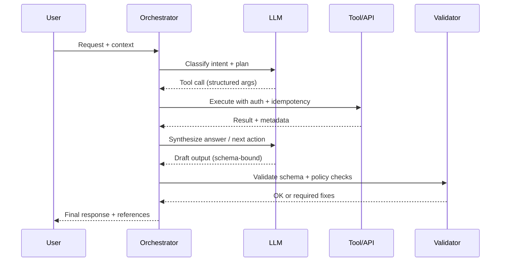

# Creating a Comprehensive System Specification for LLM Agents

## Executive summary

A high-performing LLM agent is only as reliable as the “system specification” it is given: a single, authoritative document that defines what the system is, how to interact with it, what “success” means, and how to remain safe and operable under failure modes. In practice, the most effective specification reads like an API contract + runbook + safety policy + evaluation plan, and is versioned like a product artifact (with a changelog and compatibility guarantees). Standardizing this document reduces integration ambiguity, improves agent tool-use reliability, lowers security risk (prompt injection, excessive agency), and makes operational ownership clear. citeturn6search2turn11search1turn7search3

A rigorous agent-facing spec should explicitly cover: system architecture and tool boundaries; interfaces/APIs (endpoints, auth, rate limits, formats); data sources and schemas (sample records, freshness, retention); agent goals and workflows (KPIs, escalation); input/output formats and prompt templates (token budgets, schemas, tool calls); error handling and retries (including backoff/jitter); security/privacy/access control; operational procedures (deployment, CI/CD, monitoring); maintenance/update and deprecation policy; testing/evaluation datasets and metrics; cost/resource and latency targets; governance/compliance mapping; and developer onboarding/documentation patterns. Where any detail is unknown, the spec should say so—explicitly—and treat it as “no specific constraint” until a decision is made.

Key standards and primary references that are well-suited as “anchors” for such a spec include: OpenAPI for REST interface descriptions (current recommended version 3.1.1) citeturn0search3turn8search5, JSON (RFC 8259) citeturn1search0, JSON Schema (2020-12) citeturn1search3, HTTP semantics and idempotency concepts (RFC 9110) citeturn2search0, standardized API error payloads (RFC 7807) citeturn0search4, rate limiting semantics (RFC 6585 for 429 + Retry-After) citeturn1search5, OpenTelemetry semantic conventions for observability citeturn7search0turn7search9, and NIST frameworks for AI risk, security controls, and zero trust architecture citeturn11search1turn11search2turn5search37turn3search48.

### Unspecified items register

Per your instruction, **any missing system detail is treated as “no specific constraint.”** The table below is a recommended “front page” register. Populate it during discovery; until then, it serves as a visible gap list.

| Dimension | Items that must be specified for an agent to be reliable | Current state (per prompt) |
|---|---|---|
| System identity | System name, owner, business domain, environments (dev/stage/prod) | **No specific constraint** |
| Availability & latency | SLO/SLA, p95/p99 latency targets, throughput targets | **No specific constraint** |
| Interfaces | Complete endpoint list, base URLs, protocols (REST/GraphQL/gRPC/events), data formats | **No specific constraint** |
| AuthN/AuthZ | Auth methods, token lifetimes, scopes/roles, secrets storage, least privilege model | **No specific constraint** |
| Rate limits | RPM/TPM/QPS per client/user/tenant, burst behavior, 429 policy | **No specific constraint** |
| Data sources | Source inventory, schemas, freshness, retention, PII classes | **No specific constraint** |
| Agent objectives | Task catalog, KPIs, escalation policy, “allowed actions” | **No specific constraint** |
| Tooling | Tool allowlist, sandboxing rules, side-effect policy, approvals | **No specific constraint** |
| Validation | Output schemas, validation steps, evaluation datasets/metrics | **No specific constraint** |
| Compliance | Applicability of GDPR/HIPAA/PCI/etc. and required controls | **No specific constraint** |
| Cost constraints | Budget caps, model selection constraints, caching strategy | **No specific constraint** |
| Change management | Versioning, deprecation windows, release cadence | **No specific constraint** |

## Document blueprint and architecture expectations

A “system spec for agents” should be structured so an agent can quickly answer four operational questions: **(1) What can I do? (2) How do I do it safely? (3) How do I know it worked? (4) What do I do when it fails?** This aligns naturally with reliability engineering ideas—define measurable objectives and manage risk via explicit budgets and policies. citeturn7search3turn7search4

A recommended **artifact set** (all versioned together) is:

- A human-readable spec (Markdown/Docs) that explains goals, workflows, and policy.
- Machine-readable interface specs (OpenAPI for REST, GraphQL schema, protobuf for gRPC). OpenAPI 3.1.1 is the current recommended baseline for REST. citeturn0search3turn8search5turn10search0turn8search6
- Machine-readable output schemas (JSON Schema) for agent outputs and tool calls. citeturn1search3turn13search2
- Runbooks and on-call guides (monitoring, alerting, incident response).
- Evaluation harness + datasets for regression and safety testing.

### Reference architecture components an agent spec should name

At minimum, the spec should define: the **agent runtime/orchestrator**, the **LLM provider interface**, the **tool router**, the **data access layer**, and the **policy/guardrails layer** (e.g., allowlists, approval gates, secrets management). For tool-augmented systems, strict structured outputs and explicit tool schemas substantially reduce integration errors. citeturn13search0turn0search0turn1search3

```mermaid
flowchart LR
  U[User / Calling Service] -->|Request| ORCH[Agent Orchestrator]
  ORCH -->|Prompt + context| LLM[LLM Inference API]
  ORCH -->|Tool call| TR[Tool Router / Executor]
  TR --> API[Internal APIs]
  TR --> DB[(Databases / Warehouses)]
  TR --> EVT[Event Bus / Queue]
  TR --> FS[Files / Object Store]
  ORCH --> MEM[(Conversation state / memory)]
  ORCH --> POL[Policy & guardrails\n(allowlists, approvals, PII rules)]
  ORCH --> OBS[Telemetry\n(logs/metrics/traces)]
  OBS --> MON[Dashboards & alerts]
```

## Interfaces, APIs, and I/O contracts

The agent spec must treat every interface as a **contract**: how to call it, how to authenticate, what shape data has, what errors mean, and what constitutes success. If you standardize on REST, OpenAPI gives both human- and machine-readable descriptions and is widely used for generation/testing. citeturn0search3turn8search0

### Interface comparison table

This table can be copied into your spec and filled with system-specific details.

| Interface type | Best for | Canonical machine spec | Typical payload formats | Auth patterns to document | Rate limiting to document |
|---|---|---|---|---|---|
| REST/HTTP | CRUD + resource operations; broad tooling | OpenAPI (recommend 3.1.1 baseline) citeturn0search3turn8search5 | JSON (RFC 8259), sometimes multipart citeturn1search0 | OAuth 2.0, API keys, mTLS, signed requests citeturn2search3turn4search0 | 429 semantics + Retry-After; per-user/app quotas citeturn1search5turn14search0 |
| GraphQL | Flexible client-driven querying; schema-first evolution | GraphQL schema/spec citeturn8search6turn8search8 | JSON over HTTP | OAuth/OIDC; field-level auth rules citeturn2search1 | Query-cost limits; depth/complexity caps |
| gRPC | Low-latency service-to-service; strongly typed RPC | protobuf + gRPC IDL citeturn10search0turn10search1 | Protobuf (binary), sometimes JSON | mTLS, service identity; metadata headers citeturn10search8 | QPS/stream limits; server-side load shedding |
| Event stream / queue | Async workflows; decoupling | (Often) CloudEvents for metadata citeturn9search1turn9search0 | JSON/Avro/Protobuf + event envelope | Producer/consumer identity, ACLs | Partition/topic quotas, consumer lag SLOs |
| Direct DB access | Analytics, retrieval, read-heavy ops | Schema migrations + catalog | SQL / structured rows | DB roles; read replicas | Connection pool + query budgets |
| CLI tools | DevOps workflows; batch actions | Command reference + examples | Text/JSON outputs | SSO wrappers, session creds | API backends may enforce quotas |

### What the “API section” must contain

A complete API section should include:

- **Endpoint inventory** (method + path for REST, operation list for GraphQL, RPC method list for gRPC).
- **Authentication** (mechanism, headers, token lifetimes, scopes/roles).
- **Authorization** (who can write vs read; tenant boundaries).
- **Rate limits** (steady-state + burst + backoff guidance).
- **Request/response schemas** and examples (preferably JSON Schema or OpenAPI components).
- **Error model**: status codes, error payload schema (Problem Details is a mature standard). citeturn0search4turn1search5
- **Idempotency semantics**: which operations are safe to retry; RFC 9110 explains idempotent intent for methods such as PUT. citeturn2search0

#### Example endpoint worksheet

Use this as a template; replace placeholders with your system’s real contracts.

| Operation | Purpose | Auth | Request schema | Response schema | Rate limit | Retry / idempotency notes |
|---|---|---|---|---|---|---|
| `GET /healthz` | Liveness | None or internal | None | `{status}` | N/A | No retries needed unless network |
| `GET /v1/resources/{id}` | Fetch entity | OAuth/API key | Path params | JSON object | **No specific constraint** | Safe retry on 5xx/429 |
| `POST /v1/resources` | Create entity | OAuth | JSON body | JSON object | **No specific constraint** | Must document idempotency key strategy |
| `POST /v1/actions/{id}:execute` | Run side-effect action | Strong auth + approvals | JSON body | Job/status | **No specific constraint** | Prefer async job + polling/webhook |
| `POST /v1/search` | Retrieval | OAuth | JSON body | ranked results | **No specific constraint** | Must define paging and determinism |

### Auth methods and how to document them

Your spec should **commit to one canonical description per auth method**:

- **OAuth 2.0 / OIDC**: document authorization server, scopes, token lifetimes, refresh behavior and required TLS; OAuth 2.0 and OpenID Connect are standardized specs. citeturn2search3turn2search1  
- **Signed requests (e.g., AWS SigV4)**: include signing steps, required headers, canonicalization rules, and which service endpoints require signing; AWS documents SigV4 as a specific signing protocol and includes the required request elements. citeturn4search0turn4search5  
- **Federated SAML → temporary cloud credentials**: document the federation flow and session limits. AWS STS `AssumeRoleWithSAML` returns temporary credentials tied to a SAML assertion and clarifies limitations (e.g., role chaining session duration behavior). citeturn3search1  

If your environment uses a corporate SSO wrapper for cloud CLI access (e.g., `saml2aws` with Okta), the system spec should include **the supported login flow, required configuration, and escalation channels**; your uploaded AWS CLI/Okta guidance documents are examples of the level of procedural detail that prevents access failures. fileciteturn0file0 fileciteturn0file1

## Data sources, schemas, and freshness guarantees

Agents fail in predictable ways when data is underspecified: they do not know what fields mean, how fresh data is, or whether fields are authoritative. The data section should therefore function like a **data catalog excerpt**: what data exists, how to access it, how to interpret it, and what its quality/freshness constraints are.

### Data source comparison table

| Data source type | Access path(s) to document | Schema source of truth | Update frequency to document | Key risks to document |
|---|---|---|---|---|
| OLTP relational DB | Read-only replica, service API only, or direct SQL | Migration repo + ERD | near-real-time | PII leakage; locking; schema drift |
| Data warehouse/lake | SQL endpoint + dataset names | Catalog (Glue/Unity/etc.) | hourly/daily | Staleness; aggregations vs facts |
| Object store | Bucket/path conventions | Manifest files + schema registry | event-driven/batch | Missing metadata; retention rules |
| Event bus | Topics/streams + partitioning keys | Event schema registry + versioning | streaming | At-least-once duplicates; ordering semantics (Kafka documents delivery semantics tradeoffs) citeturn9search5 |
| External vendor API | Base URL + SDK versions | Vendor docs | varies | API changes; rate limits; data residency |
| Vector store / retrieval index | Index name + embedding model | Index mapping + chunking spec | near-real-time/batch | Retrieval leakage; stale embeddings |

### Schema requirements and sample record patterns

Use JSON Schema (2020-12) or equivalent to define machine-checkable output and input constraints. citeturn1search3 The minimal schema writeup for each entity should include:

- Field name, type, nullability, units, allowed values.
- Primary keys and foreign keys.
- PII classification (none/low/high) and masking rules.
- Freshness and backfill rules.
- Retention and deletion policy (tie to compliance).

A sample record format (example only; replace with your entities):

```json
{
  "entity_type": "customer_profile",
  "id": "cust_123",
  "updated_at": "2026-02-22T21:15:08Z",
  "attributes": {
    "segment": "SMB",
    "lifetime_value_usd": 12500.55
  },
  "pii": {
    "contains_pii": true,
    "fields": ["email"]
  },
  "provenance": {
    "source_system": "crm_service",
    "ingested_at": "2026-02-22T21:16:00Z"
  }
}
```

### Update frequency and “freshness contracts”

A key best practice is to specify **a freshness SLO** (e.g., “99% of records updated within 15 minutes of source-of-truth update”) and treat violations as “data incidents” with on-call ownership. This mirrors SRE guidance that reliability targets must be measurable and managed with explicit budgets. citeturn7search3turn7search4  
If you do not yet have freshness requirements, record **“no specific constraint”** and add an owner to decide.

## Agent objectives, workflows, and prompt-and-tool contracts

Agents need a **goal hierarchy** (primary objective → sub-tasks → measurable KPIs) and a **workflow language** that tells them when to plan, when to call tools, when to ask for clarification, and when to escalate to a human.

### Goals, tasks, and KPIs structure

A high-clarity format is:

- **Primary objective**: what business outcome the agent should optimize.
- **Sub-tasks**: decomposed, testable actions (retrieve data, validate, execute change, confirm).
- **Success metrics**: task completion rate, correctness, time-to-resolution, auditability, safety.
- **Guardrail constraints**: what the agent must never do (e.g., irreversible actions without approval).

For reliability, adopt the principle that “100% success” is rarely a useful target; instead define explicit SLOs and track error budgets (allowed failure rates) as Google SRE recommends. citeturn7search3turn7search4

### Workflow diagram



### Prompt templates and structured output

Modern agent systems increasingly rely on **schema-constrained outputs** to reduce ambiguity and parsing failures. OpenAI’s “Structured Outputs” capability is explicitly designed to make model outputs reliably conform to developer-supplied JSON Schemas, including via tool/function calling with `strict: true`. citeturn0search0turn13search0turn13search2

#### Recommended prompt template table

These are templates you can adapt; token numbers are starting points and should be tuned based on your model/context needs. (If you have no current limits, record “no specific constraint.”)

| Template | When to use | Output format | Suggested token budget | Notes |
|---|---|---|---|---|
| System policy + role | Always | Natural language constraints | **No specific constraint** | Include “never do” rules and escalation criteria; align with OWASP LLM risks like prompt injection/excessive agency citeturn6search2 |
| Task planner | Multi-step tasks | JSON plan schema | 300–800 output tokens | Keep plan short; focus on tool calls and checks |
| Tool call wrapper | Whenever tools exist | Tool args via JSON Schema | 100–300 output tokens | Use strict schemas; OpenAI notes strict mode requirements like `additionalProperties: false` and fields marked `required` citeturn13search2 |
| Retrieval + cite | RAG workflows | JSON with `claims[]` + `sources[]` | 400–1200 output tokens | Separate “facts from sources” vs “inferences” |
| Final user response | Human-facing output | Markdown/text | **No specific constraint** | Keep user response separate from planning |

#### Example: tool schema + strict structured outputs

When using function/tool calling, define tool parameters with JSON Schema. OpenAI recommends enabling strict mode to make function arguments reliably adhere to the schema. citeturn13search2turn13search0

```json
{
  "type": "function",
  "name": "create_ticket",
  "description": "Create a support ticket in the internal system.",
  "strict": true,
  "parameters": {
    "type": "object",
    "properties": {
      "title": { "type": "string" },
      "severity": { "type": "string", "enum": ["low", "medium", "high", "critical"] },
      "customer_id": { "type": ["string", "null"] },
      "description": { "type": "string" }
    },
    "required": ["title", "severity", "customer_id", "description"],
    "additionalProperties": false
  }
}
```

### Token budgets and context windows

Your system spec should explicitly state the model’s maximum context window and max output, because it constrains how much conversation state, documents, and tool outputs the agent can safely carry. For example, OpenAI model docs list context window sizes and max output tokens for specific model families. citeturn14search3turn15search3  
If your system has no limit decisions yet, record **“no specific constraint”** and include an action item to select a model and define budgets for: system prompt, conversation history, retrieved context, tool outputs, and final response.

## Error handling, retries, and reliability controls

Agents interact with unreliable networks and rate-limited APIs; the system spec must define a precise retry policy so the agent does not “thrash” (waste tokens, overload dependencies, or duplicate side effects).

### Standardize your error model

For HTTP APIs, use a consistent error payload format. RFC 7807 (“Problem Details for HTTP APIs”) defines a widely used JSON structure (e.g., `type`, `title`, `detail`, `instance`) that makes errors machine-readable. citeturn0search4  
For rate limiting, HTTP 429 semantics and the optional `Retry-After` header are standardized in RFC 6585. citeturn1search5

### Retry policy expectations

A robust “agent retry policy” table documents what to retry, how long to wait, and what *not* to retry.

| Failure class | Examples | Agent action | Rationale |
|---|---|---|---|
| Rate limit | 429 | Retry with exponential backoff + jitter; honor Retry-After when present citeturn1search5turn11search3 | Avoid synchronized retry storms; AWS recommends jittered backoff patterns citeturn11search3 |
| Transient server | 500/503 | Retry with capped backoff + jitter; limit attempts | OpenAI’s error guidance includes retrying after brief waits for server errors/overload citeturn14search0 |
| Network | timeouts, DNS | Retry with backoff; fail over if possible | Prevent hanging calls |
| Validation/client | 400/422 | Do not retry blindly; fix request | Retrying repeats invalid request |
| Auth failures | 401/403 | Do not retry; refresh credentials or escalate | Prevent lockouts, respects least privilege |

For OpenAI API integrations specifically, OpenAI documents common API errors (including 429 rate limit, 503 overload, 401 auth issues) and recommends pacing/retrying appropriately. citeturn14search0turn16search1

### Observability requirements

The system spec should mandate telemetry for:

- Every agent request (trace id / request id).
- Every tool invocation (tool name, latency, status, retries).
- Every policy decision (allowed/blocked + reason code).

OpenTelemetry semantic conventions standardize names/attributes for traces/metrics/logs, enabling consistent correlation across services. citeturn7search0turn7search9

## Security, privacy, access control, and governance

A system spec for agents must be explicit about **what data the agent may access, what actions it may take, and how to prevent common LLM-specific threats**. OWASP’s Top 10 for LLM Applications highlights risks such as prompt injection, insecure output handling, sensitive data disclosure, and excessive agency. citeturn6search2

### Core security requirements to document

- **Least privilege** for both humans and service identities: NIST SP 800-53 is the canonical security-controls catalogue; its broader purpose is to provide a comprehensive set of security and privacy controls for systems. citeturn5search37  
- **Zero trust assumptions**: NIST SP 800-207 formalizes the “no implicit trust based solely on network location” model and focuses on protecting resources with continuous authentication/authorization. citeturn3search48  
- **Encryption**: define minimum TLS version in transit; define encryption at rest; define key management ownership.
- **Secrets handling**: where API keys/tokens live, rotation cadence, incident response.
- **Audit logging**: what events are recorded for compliance and forensic analysis.

If your agent uses OpenAI APIs, OpenAI’s API authentication reference specifies bearer-token usage (`Authorization: Bearer …`) and discusses request headers for org/project attribution. citeturn16search1 OpenAI also publishes recommended API key safety practices (unique keys per user, never ship to client-side, don’t commit to repos, rotate/monitor). citeturn15search0

### Privacy and compliance mapping

Your spec should include an explicit “compliance applicability matrix” and then list required controls. If unknown, mark as **no specific constraint**.

- **GDPR**: the European Commission summarizes core principles including lawfulness/fairness/transparency, purpose limitation, and data minimization. citeturn6search3  
- **HIPAA (if applicable)**: HHS describes the HIPAA Privacy Rule “minimum necessary” requirement—reasonable steps to limit uses/disclosures/requests of PHI to the minimum necessary for the purpose. citeturn6search0  
- **AI governance**: NIST AI RMF 1.0 and the Generative AI Profile provide risk management framing and actions relevant to GenAI systems. citeturn11search1turn11search2

### Identity and cloud access example

If the agent (or developers operating it) must access cloud services via federated identity, document the exact supported mechanism and session properties. AWS STS `AssumeRoleWithSAML` explicitly describes temporary credentials issuance based on SAML assertions. citeturn3search1  
Your uploaded internal guidance on using `saml2aws` with Okta/SSO illustrates the level of operational detail needed to keep CLI access working through security posture changes. fileciteturn0file0 fileciteturn0file1

## Operations, maintenance, testing, evaluation, and cost modeling

### Operational procedures and monitoring

A production-grade agent system spec should include:

- **Deployment model** (containers/serverless), environments, and rollback strategy.
- **CI/CD** steps, required checks (lint, tests, security scans), and artifact signing.
- **Monitoring & alerting**: golden signals (latency, traffic, errors, saturation), task success rate, tool error rate, drift indicators.
- **Incident response runbooks** and on-call ownership.
- **Change control**: when prompts/models/tools can change and how to validate changes.

SRE guidance emphasizes that reliability targets must be chosen intentionally and tracked via error budgets; this should be reflected in agent SLOs (task success and latency) and in release gates. citeturn7search3turn7search4

### Maintenance and update processes

The spec should define:

- **Versioning** for prompts, tool schemas, and APIs (semantic versioning or equivalent).
- **Deprecation windows** (how long older tools/schemas remain supported).
- **Model update policy**: whether you pin model snapshots for stability (many vendors provide snapshot/versioned model identifiers) citeturn15search3turn14search2
- **Schema migrations**: how data contracts evolve and how the agent remains backward compatible.

### Testing and validation strategy

A complete plan covers classic software testing plus agent evaluation:

- **Unit tests** for tool wrappers and schema validators.
- **Integration tests** for each API/tool against staging.
- **End-to-end tests** for core workflows (including retries and partial outages).
- **Safety and adversarial tests** (prompt injection attempts, data exfiltration probes), aligned to OWASP LLM risk categories. citeturn6search2  
- **TEVV / evaluation**: use NIST guidance as a structure for trustworthy AI risk management and GenAI-specific risks. citeturn11search1turn11search2

Structured outputs can be used as a test oracle: validate that tool-call arguments and agent outputs conform to JSON Schema (and reject otherwise). OpenAI’s structured outputs approach is explicitly intended to guarantee schema adherence under strict mode. citeturn0search0turn13search2

### Supply chain integrity for agent deployments

Because agent systems include many dependencies (models, SDKs, prompts, tools), treat the build pipeline as a security boundary.

- **SLSA** provides a framework/checklist for software supply chain integrity and defines provenance as verifiable information describing how artifacts were produced. citeturn12search0turn12search2  
- **Sigstore/cosign** supports signing and verifying artifacts (including keyless signing and transparency logs) to reduce tampering risk. citeturn12search5turn12search6

### Cost and resource estimates

Your spec should include a cost model with (a) variables, (b) a worked example, and (c) levers to reduce cost.

For OpenAI APIs, pricing is typically stated per 1M tokens (input/cached/output), with separate pricing for embeddings and other modalities. citeturn14search1 Rate limits can also be tiered and should be treated as capacity constraints when planning throughput. citeturn15search3turn14search2

Below is an **illustrative** cost breakdown chart (replace with your real volumes, model choice, and infra costs):


And an **illustrative** p95 latency budget allocation across typical agent stages (replace with measured values once instrumented):


A minimal cost worksheet to include in the spec:

- Monthly requests = `N`
- Avg input tokens/request = `Tin`
- Avg output tokens/request = `Tout`
- Model token prices = from provider pricing page citeturn14search1
- Estimated LLM cost/month ≈ `(N*Tin/1e6)*input_price + (N*Tout/1e6)*output_price`
- Add: embeddings cost, vector DB, storage, observability, tool compute, human review/QA

If cost constraints are not yet defined, record **“no specific constraint”** and add a governance step to set monthly caps and alerts.

### Developer onboarding and documentation

A common failure mode is “great reference docs but no learning path.” The Diátaxis framework is a practical way to structure documentation into **tutorials, how-to guides, technical reference, and explanation**, aligned to distinct user needs. citeturn8search4 Embed this directly into your onboarding plan:

- **Tutorial**: “Run the agent locally; call one tool; see one successful workflow.”
- **How-to**: “Add a tool,” “Add a new endpoint,” “Add a data source,” “Run evals.”
- **Reference**: OpenAPI/GraphQL/protobuf schemas, tool schemas, policy matrices.
- **Explanation**: design rationale, threat model, tradeoffs, and deprecations.

Finally, include a “first week checklist” (accounts, access, local dev, staging smoke tests) and a “who to ask” ownership table. If onboarding ownership is undefined, mark it as **no specific constraint** and assign an initial owner—lack of ownership is itself an operational risk.

